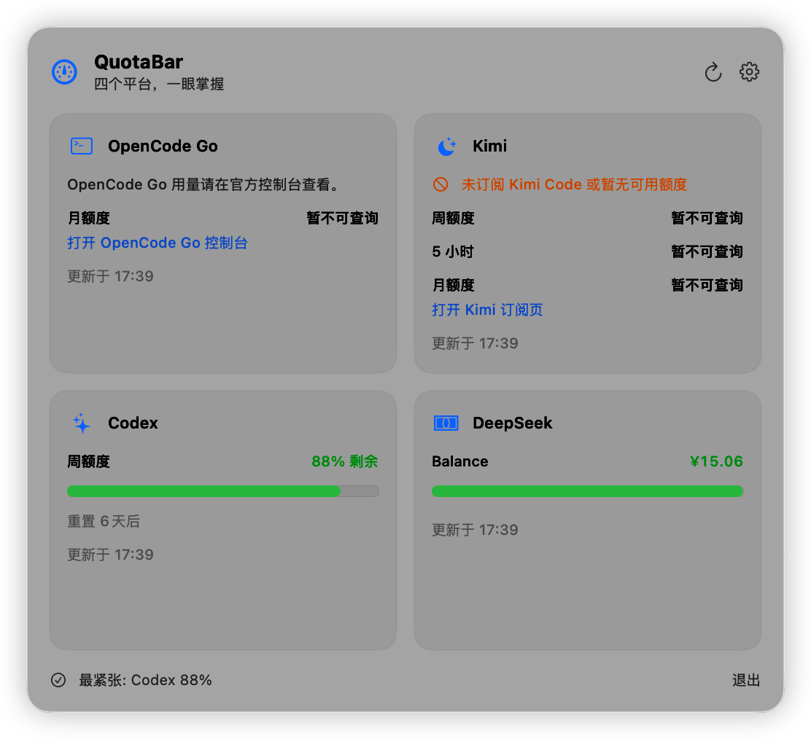
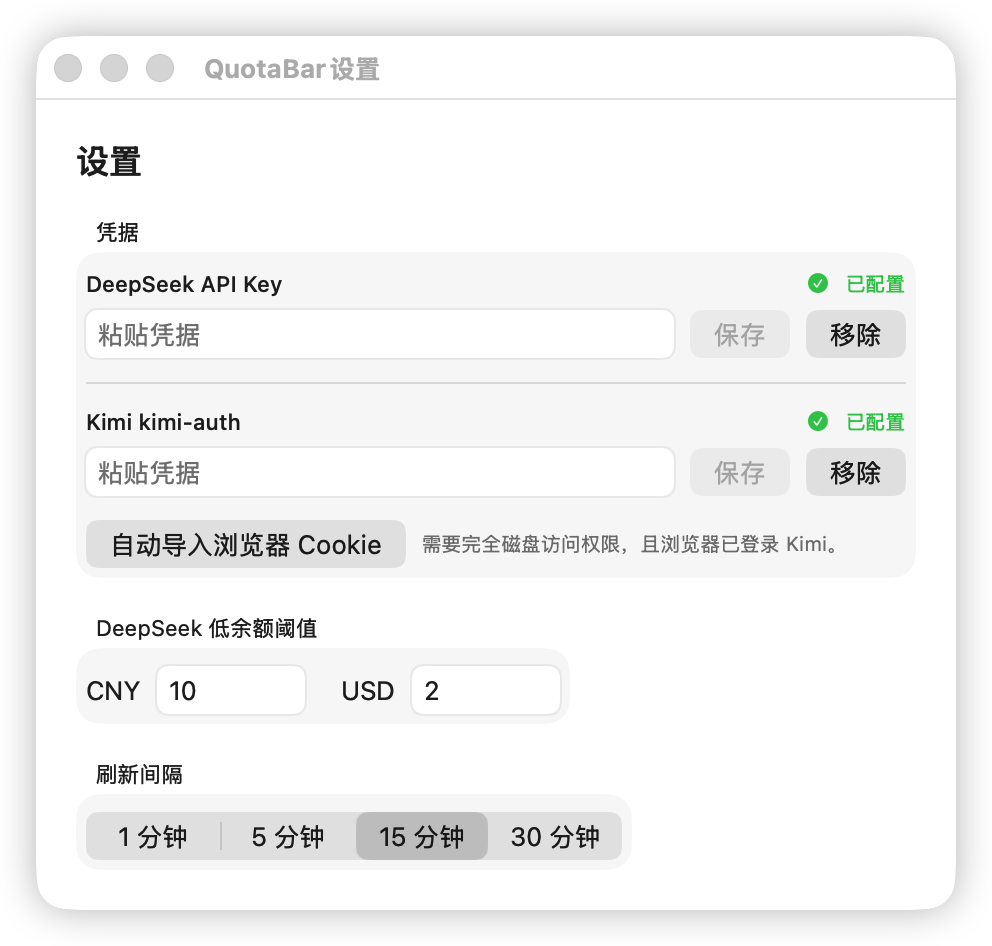

# QuotaBar

macOS 14+ 原生菜单栏额度查询工具，集中展示：

- OpenCode Go：不需要本机 CLI；在官方控制台查看订阅用量。
- Kimi Code：5 小时、周额度；月额度当前显示订阅页入口。
- Codex：周剩余额度。
- DeepSeek：CNY/USD 余额和账户可用状态。

菜单栏显示所有可用指标中最紧张的一项。DeepSeek 使用可配置阈值归一化，默认 CNY ¥10、USD $2。单个平台失败不会阻断其他平台，最近一次成功值会保留并标记为旧数据。

## 界面预览

主界面：



设置界面：



## 工程结构

- `Sources/QuotaCore`：统一模型、并行协调器、四个平台探针、进程和网络抽象。
- `Sources/QuotaBar`：SwiftUI/AppKit 菜单栏、Keychain、浏览器 Cookie 导入、设置和本地化。
- `Tests/QuotaCoreTests`：窗口边界、解析 fixture、聚合和过期数据测试。
- `Tests/QuotaBarTests`：刷新合并和卡片渐进更新测试。
- `project.yml`：XcodeGen 工程定义。
- `Package.swift`：独立运行 QuotaCore 单元测试。

## 本地构建

要求：完整 Xcode、XcodeGen、macOS 14+。

```bash
xcodegen generate
xcodebuild -project QuotaBar.xcodeproj -scheme QuotaBar -destination 'platform=macOS' test
```

也可以只测试核心模块：

```bash
swift test
```

## 安装与 Release

正式版本从 [GitHub Releases](https://github.com/kanelogger/QuotaBar/releases) 下载，要求 macOS 14+。

- `QuotaBar-<version>.dmg`：打开后将 QuotaBar 拖入 Applications。
- `QuotaBar-<version>-macos.zip`：解压后将 QuotaBar 移入 Applications，适合脚本安装和后续 Homebrew Cask。
- `SHA256SUMS.txt`：使用 `shasum -a 256 -c SHA256SUMS.txt` 校验 DMG 与 ZIP 的完整性。

Release 应用使用 Developer ID 签名并经 Apple 公证。首次发布前需要有效 Apple Developer Program 会员、已安装的 `Developer ID Application` 证书，以及 `notarytool` Keychain profile。发布脚本读取本机环境变量 `DEVELOPMENT_TEAM`、`DEVELOPER_IDENTITY` 和 `NOTARY_PROFILE`，不保存任何凭据到仓库。

发布者从 `main` 的 `v<version>` tag 运行 `scripts/release.sh` 生成并公证产物，再运行 `scripts/verify-release.sh dist/v<version>` 验证。`scripts/publish-github-release.sh` 创建草稿 Release；确认说明和资产后，以 `--publish` 发布为 latest。

在干净的 macOS 用户环境中，分别从 DMG 和 ZIP 安装并启动一次 QuotaBar；确认菜单栏出现、设置可编辑，且 Codex、OpenCode Go 与 Kimi 入口均可用后，才发布 GitHub Release。

Codex 依赖本机 CLI。OpenCode Go 用量通过官方控制台入口查看。DeepSeek API Key 和手动 Kimi `kimi-auth` 保存在系统 Keychain。Kimi 在 Keychain 没有手动 Token 时会尝试从已登录浏览器读取 Cookie；该能力需要用户给 QuotaBar 完全磁盘访问权限。

## Kimi 月额度边界

Kimi Code 的 5 小时和周额度使用 `BillingService/GetUsages`。会员共享月额度位于订阅页，当前没有经过真实账号验证的稳定机器接口，因此 v1 明确显示“暂不可查询”并提供订阅页入口。代码通过 `KimiMonthlyUsageProviding` 保留独立实现接缝；只有捕获并脱敏真实只读响应、补齐 fixture 契约测试后才应启用。

未订阅 Kimi Code 的账号当前返回 HTTP 200 与空 JSON 对象；应用会将 5 小时、周和月额度标记为不可用，并提示订阅状态，不把它误报为接口格式变化。

应用不记录 Token、Cookie、Authorization Header 或原始私密响应。
